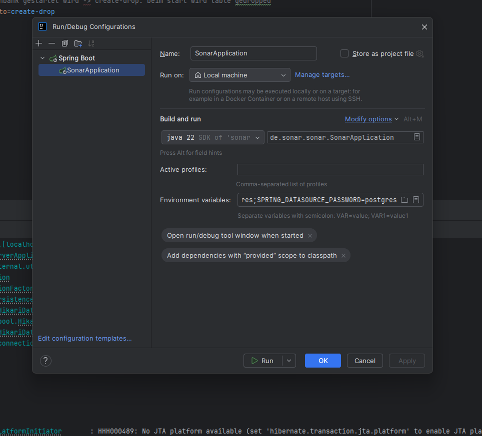
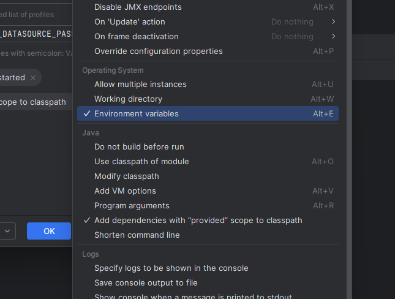
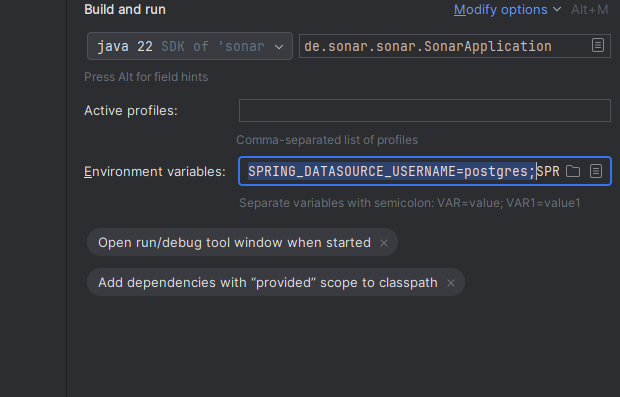

```bash,ignore
  ______     ___                  _       _______     
.' ____ \  .'   `.               / \     |_   __ \    
| (___ \_|/  .-.  \ _ .--.      / _ \      | |__) |   
 _.____`. | |   | |[ `.-. |    / ___ \     |  __ /    
| \____) |\  `-'  / | | | |  _/ /   \ \_  _| |  \ \_  
 \______.' `.___.' [___||__]|____| |____||____| |___|

Soziales Online Aktivitäten Register
```                                        

## Team
List the team members involved in the project:

Team Leader: 
- Till Patron (Backend-Experte)

Members:
- Fabian Serves (Architektur-Experte)
- Max van Lier (Infrastruktur-Experte)
- Nils Palberg (Frontend-Experte / UML-Experte)
- Micha Keiten (Projektleiter)
- Benjamin Braun (SCRUM-Experte)
- ~~Patrick Drechsel (Frontend-Experte)~~

## Quickstart

This section outlines the steps required to get your project up and running quickly:

```bash,ignore
# Start the project (./sonar)
$ docker compose up -d
```

## Prerequisites

Detail all the necessary prerequisites for running your project, such as:

Operating System: Linux, macOS, Windows

Software: Docker

Prototyp: [Figma Prototyp](https://www.figma.com/proto/G1wOTb3iaOJeZSlVaQ27tN/SWT1-Prototype?page-id=132%3A558&node-id=153-560&viewport=343%2C-544%2C0.44&t=oGkMymRAoTJUZyHt-1&scaling=scale-down&content-scaling=fixed&starting-point-node-id=153%3A560&show-proto-sidebar=1)
Passwort: swt1

### Tech-Stack: 
  - React (Frontend) https://react.dev
  - Springboot (Backend): https://start.spring.io/
  - PostgreSQL (Database): https://postgresql.org

Ports: 8080 (Backend), 8081 (Frontend), 5432 (Database), 9091 (Herne-Backend), 1883 (MQTT), 9001 (MQTT)

## Installation and Setup

Provide step-by-step instructions on how to clone the repository, install the project, and configure it:

1. Clone the repository:
```bash,ignore
$ git clone https://github.com/tpatron-fhdo/sonar.git
```

2. Navigate to the project directory:
```bash,ignore
$ cd sonar
```

3. Adjust configuration files:

[//]: # (Modify configuration files &#40;e.g., `.env`, `application.properties`&#41; as required.)

Im Verzeichnis `sonar` muss vor dem ersten Starten ein neues Verzeichnis mit dem Namen `.env` erstellt werden.
In diesem Verzeichnis wird die Datei `credentials.env` erstellt.
In dieser Datei werden jetzt die Werte für `POSTGRES_USER` und `POSTGRES_PASSWORD` gesetzt.

Zum Starten des Sonar-Backends ist eine Konfiguration der Login-Daten für die PostgreSQL-Datenbank nötig.
Im Folgenden ist eine bebilderte Anleitung:

Über das Menü `Edit Configuration` können die Umgebungsvariablen, die zum Starten der Anwendung benötigt werden,
gesetzt werden.



Mit einem Click auf `Modify options` erscheint das folgende Dropdown-Menü, in welchem `Envorinment variables` angeklickt
werden muss.



Anschließend werden die Werte für `SPRING_DATASOURCE_USERNAME` und `SPRING_DATASOURCE_PASSWORD` gesetzt.
Diese Werte müssen denen aus der `sonar/.env/credentials.env` entsprechen.



## Running the Project

Explain in detail how to run the project, including:

Starting the database

Initializing data (if needed, via scripts)

Starting the server

```bash,ignore
# Start the project (./sonar)
$ docker compose up -d
```

## Project structure
Provide an overview of the directory structure to help contributors navigate the project:
```bash,ignore
Sonar/
├── sonar/                     # Description of this subproject
  ├── env/                      # Envorinment Files containing credentials
  ├── docker-compose.yaml      # File to start whole application
  ├── sonar-backend            # Backend for Sonar application
    ├── src/main/              # Source code
    └── src/test/              # Test cases
  ├── sonar-frontend           # WebApp
  ├── herne-backend            # Dummy Backend
    ├── src/main/              # Source code
    └── src/test/              # Test cases
  └── mosquitto                # MQTT Broker
├── documentation/             # Documentation
└── README.md                  # This file
```

## Git Workflow

- A separate feature branch is created for each user story
- Sub issues are merged into the respective feature branches of the user story
- The feature branch is only merged into the main branch once the Definition of Done of a user story has been fulfilled

### Branch Naming
- feature/[Ticket-Nr z.B. 20]-[Ticket-Name]
- e.g.: feature/20-datenmodell
